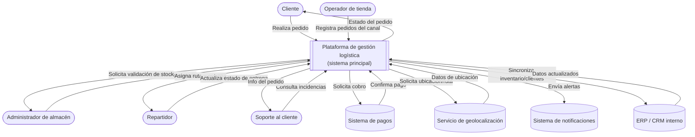

# Diagrama de contexto

El siguiente diagrama muestra el sistema de gestión logística en el centro,
junto con los actores y sistemas externos que interactúan con él, y el flujo
principal de información entre ellos.

## Descripción del diagrama

- **Centro**: la plataforma de gestión logística, que centraliza pedidos, inventario, rutas y entregas.
- **Actores humanos**: cliente, operador de tienda, administrador de almacén, repartidor y soporte, cada uno interactuando con el sistema según su rol.
- **Sistemas externos**: pagos, geolocalización, notificaciones y el ERP/CRM, con los que el sistema se comunica pero que no forman parte de él.
- **Límite del sistema**: todo lo que está dentro del rectángulo central es responsabilidad de esta plataforma; lo demás son servicios externos con los que solo se integra.
